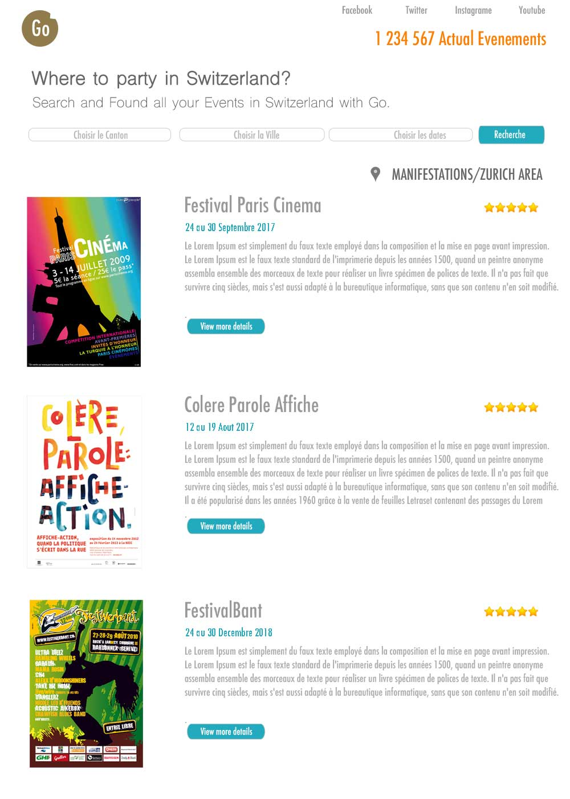

# App
## Components
* Header:
  * Logo
  * Social
  * Amount of events
* Filter:
  * Form
  * Current Filter
* List View
  * List-View-Item
    * Image
    * Title
* Item
  * Title
  * Location(Google maps integration)
  * Date
  * Description
  * Image

## States
* Events
* Current event
* Filter

## Reducers
* One per each state

## Dispatchers
* One reducer per state
* API calls as function-actions!

## MockUp

The final app would have two views. Only one would be implemented in the first iteration and the second one would be as extra-credit:

* Grid view:

* List view: First to be implemented

